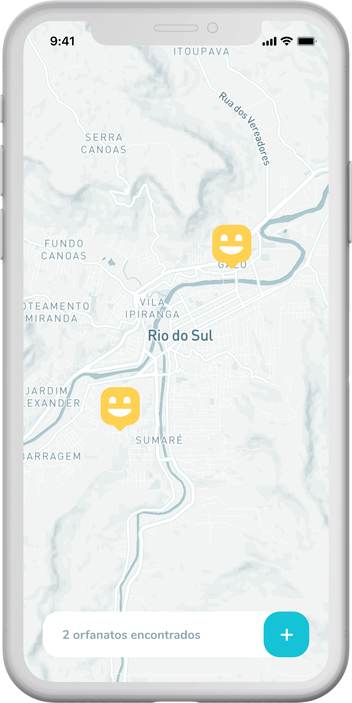

<h1 align="center">
  <br />
  
</h1>

<h4 align="center">O Happy é uma aplicação para conectar pessaoas que desejam visitar orfanatos, orientando estas e levando felicidade a todas estas crianças. </h4>

<p align="center">
  
  
  
  <a href="https://rocketseat.com.br/">
    
  </a>
</p>

<p align="center">
  <a href="#-instalação">Instalação</a>&nbsp;&nbsp;&nbsp;|&nbsp;&nbsp;&nbsp;
  <a href="#-tecnologias">Tecnologias</a>&nbsp;&nbsp;&nbsp;|&nbsp;&nbsp;&nbsp;
  <a href="#-créditos">Créditos</a>&nbsp;&nbsp;&nbsp;|&nbsp;&nbsp;&nbsp;
  <a href="#-licença">Licença</a>
</p>

<p align="center">
  &nbsp;&nbsp;
</p>

# ⚙ Instalação

Para clonar e executar a aplicação é necessário [Git](https://git-scm.com) e [Node.js](https://nodejs.org/en/download/) (que instala também o [npm](http://npmjs.com)). Em sua linha de comando:

```bash
# Clone o repositório
$ git clone https://github.com/marcosribeirodacunha/happy.git

# Entre no repositório
$ cd happy
```

## 💻 Web

Antes de iniciar a aplicação web crie uma conta em [mapbox](https://www.mapbox.com/) e copie o access token em sua conta. Logo após renomeie o arquivo `.env.example` para `.env` e insira seu token na variavel `REACT_APP_MAPBOX_TOKEN`.

Logo após realize os seguintes passos:

```bash
# Instale as dependências dentro do diretório web
$ cd web
$ npm install
// ou yarn

# Iniciar a aplicação
$ npm start
// ou yarn start
```

## 💾 Backend

```bash
# Instale as dependências dentro do diretório backend
$ cd backend
$ npm install
// ou yarn

# Criar as tabelas no banco de dados
$ npm run typeorm migration:run
// ou yarn typeorm migration:run

# Iniciar a aplicação
$ npm run dev
// ou yarn dev
```

## 📱 Mobile

**Importante:** Ao inicar a aplicação siga os seguintes passos:

- Será aberta uma página em seu navegador. Confira nesta o endereço de IP localizado proximo a tab LAN;
- Verifique se este IP condiz com o mesmo localizado nos campos:
  - `url` localizado em `backend/src/views/images_view.ts`
  - `baseURL` localizado em `mobile/src/services/api`.
- Caso os mesmo não condizam, troque seus valores pelo IP observado no inicio deste processo.

```bash
# Instale as dependências dentro do diretório mobile
$ cd mobile
$ npm install
// ou yarn

# Iniciar a aplicação
$ npm start
// ou yarn start
```

# 👨‍💻 Tecnologias

- [Typescript](https://www.typescriptlang.org/)
- [NodeJS](https://nodejs.org/en/)
- [Express](https://expressjs.com/pt-br/)
- [ReactJS](https://pt-br.reactjs.org/)
- [React Native](https://reactnative.dev/)
- [Expo](https://expo.io/)
- [TypeORM](https://typeorm.io/#/)
- [React Router](https://reactrouter.com/web/guides/quick-start)
- [React Leaflet](https://react-leaflet.js.org/)

Para mais detalhes sobre recursos e tecnologias:

- [README do Backend](https://github.com/marcosribeirodacunha/happy/tree/master/backend)
- [README do Frontend (web)](https://github.com/marcosribeirodacunha/happy/tree/master/web)
- [README do Mobile](https://github.com/marcosribeirodacunha/happy/tree/master/mobile)

# 🎞 Créditos

Aplicação construída durante a Next Level Week #3, realizada por :rocket: [Rocketseat](https://rocketseat.com.br/).

# 📜 Licença

Esse projeto está sob a licença MIT. Veja o arquivo [LICENSE](LICENSE) para mais detalhes.
