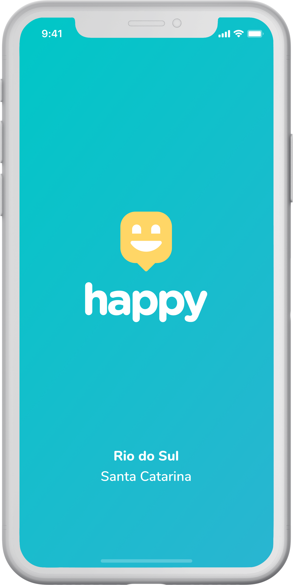

<h1 align="center">
   
  
</h1>

<h1 align="center">Happy Mobile</h1>

  <a href="#-recursos">Recursos</a>&nbsp;&nbsp;&nbsp;|&nbsp;&nbsp;&nbsp;
  <a href="#-tecnologias">Tecnologias</a>

  &nbsp;&nbsp;
  &nbsp;&nbsp;
  

## 🗃 Recursos

- [x] Visualização dos orfanatos no mapa
- [x] Cadastro de orfanatos com imagens em duas etapas
  - [x] Selecionar localização no mapa
  - [x] Preencher dados
- [x] Listagem dos detalhes de um orfanato

## 👨🏽‍💻 Tecnologias

- [Typescript](https://www.typescriptlang.org/)
- [React Native](https://reactnative.dev/)
- [Expo](https://expo.io/)
- [React Navigation](https://reactnavigation.org/)
- [Axios](https://www.npmjs.com/package/axios)
- [React Native Maps](https://www.npmjs.com/package/react-native-maps)
