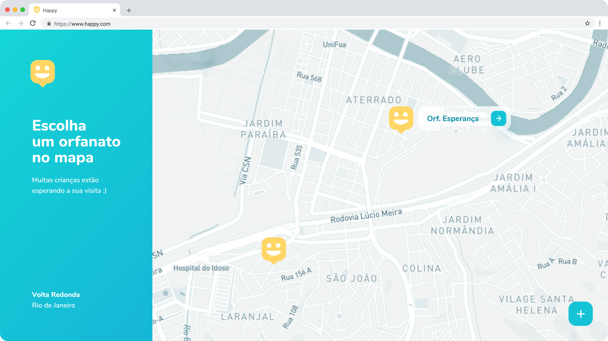

<h1 align="center">
   
  
</h1>

<h1 align="center">Happy Web</h1>

  <a href="#-recursos">Recursos</a>&nbsp;&nbsp;&nbsp;|&nbsp;&nbsp;&nbsp;
  <a href="#-tecnologias">Tecnologias</a>

  

## 🗃 Recursos

- [x] Visualização dos orfanatos no mapa
- [x] Cadastro de orfanatos com imagens
- [x] Listagem dos detalhes de um orfanato

## 👨🏽‍💻 Tecnologias

- [Typescript](https://www.typescriptlang.org/)
- [ReactJS](https://reactjs.org/)
- [Create React App](https://create-react-app.dev/)
- [React Router](https://reactrouter.com/web/guides/quick-start)
- [Axios](https://www.npmjs.com/package/axios)
- [Leaflet](https://leafletjs.com/)
- [React Leaflet](https://react-leaflet.js.org/)
- [Mapbox](https://www.mapbox.com/)
